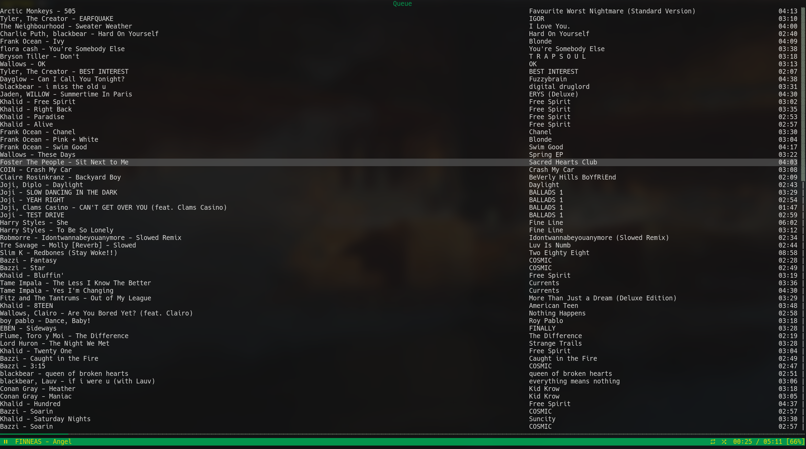

# ncspot

Custom fork of [ncspot](https://github.com/hrkfdn/ncspot) based around personal preferences.


## Features
Read the upstream readme for the entire documentation

* Notification has the album cover art
* Play and pause icons are reversed
* Simmilar tracks have album name
* Made for you tab

--- 

##### custom commands:
`:queueall` - queue all songs proceeding selection (and included).

### Installation guide
1. compiling the program:
```sh
$ git clone https://github.com/mtshrmn/ncspot.git --recursive
$ cd rspotify && git apply ../rspotify.patch && cd
$ cargo build --release # use whatever features you like
```
2. getting your spotify cookies:
 - 1. go to spotify.com
 - 2. open developer options and find your cookies
 - 3. copy the 4 cookies in the following format: `sp_dc=<VALUE>; sp_t=<VALUE>; sp_landing=<VALUE>; sp_key=<VALUE>` into `$HOME/.config/ncspot/cookie.txt` (in the same directory where `config.toml` is)
 - 4. once a year or something you'll have to update your cookies as they have an expiration date.

